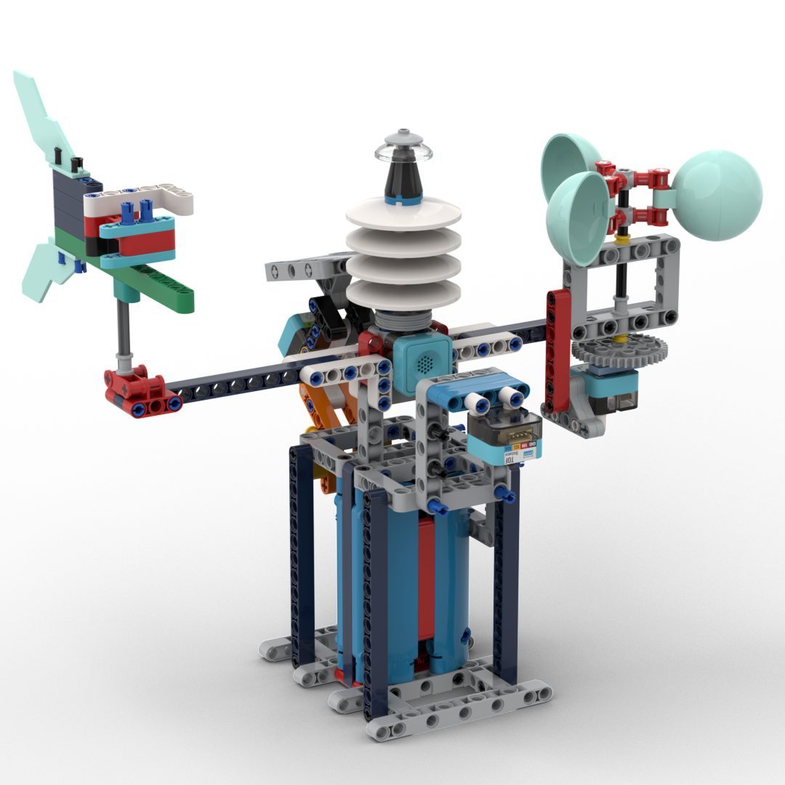
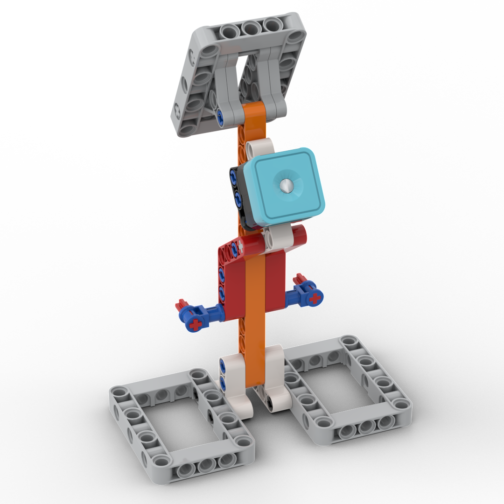
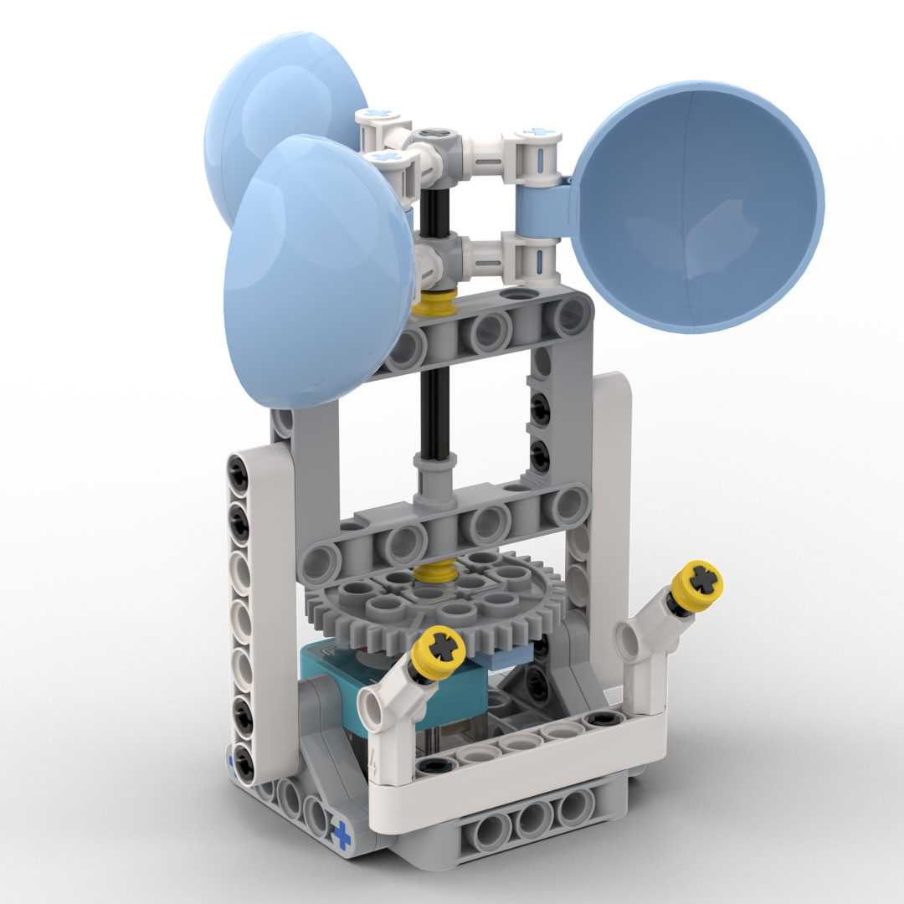
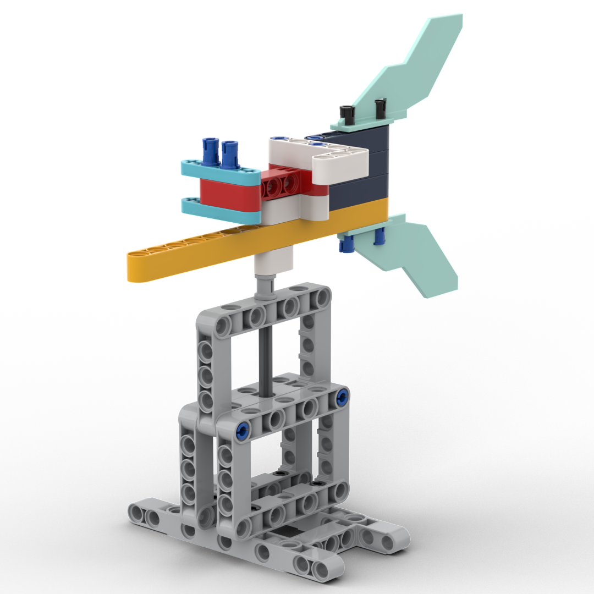

# 未來板物聯氣象站套件

未來板物聯氣象站套件是一套集風向、風速、雨量、溫度檢測的學習套件。學生可以從每個應用中學習到氣象與天氣等的科學知識，並可以透過物聯網應用學習到IoT與我們生活的密切關係。

## 套件內容

- 未來板連128MB SD卡 *1
- iobit 2.0入門擴展板 *1
- 鋰電池 *1
- Sugar 雷射測距模組 *1
- Sugar 光敏感應模組 *1
- Sugar 磁力感應模組 *1
- Sugar 氣壓海拔模組 *1
- 組裝積木包

## 套件特色

1. 融合科學與編程，體現出STEM的教育理念

## 套件應用案例介紹

### 1. 溫度氣壓站

### 2. 雨量檢測

### 3. 環境亮度檢測

### 4. 風速檢測

### 5. 風向檢測

### 6. 風速+風向檢測

### 7. 完整氣象站

