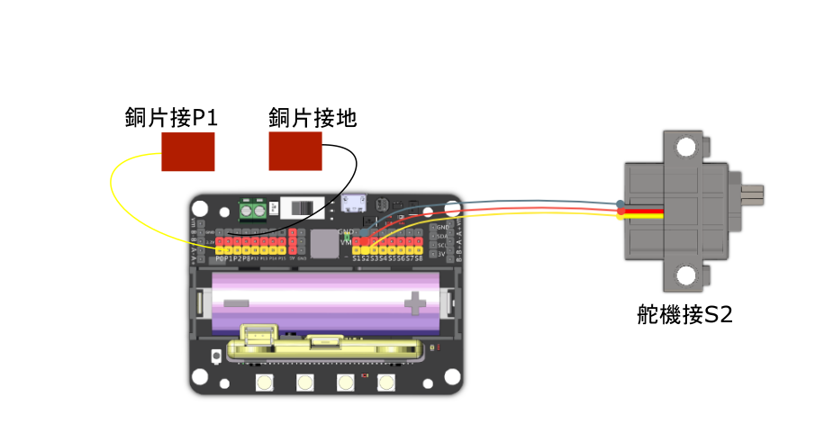

# 3. 硬幣收藏家

## 教材資源包下載

包括說明書： [資源包下載地址](http://bit.ly/MeowbitCreatorKit_SH_ResourcsePack)

## 參考接線

## 參考程式

[硬幣收藏家Arcade參考程式](https://makecode.com/_MFFLfW0RUKuX)

[Kittenblock sb3 參考程式資源包下載地址](http://bit.ly/MeowbitCreatorKit_SH_ResourcsePack)

## 模型玩法

這是一個錢箱，能夠幫助你儲錢。將硬幣放在錢箱的手上，它就會把硬幣吞下。直至錢箱裏儲夠20個硬幣才可以按A鍵打開錢箱將錢幣拿出來。
