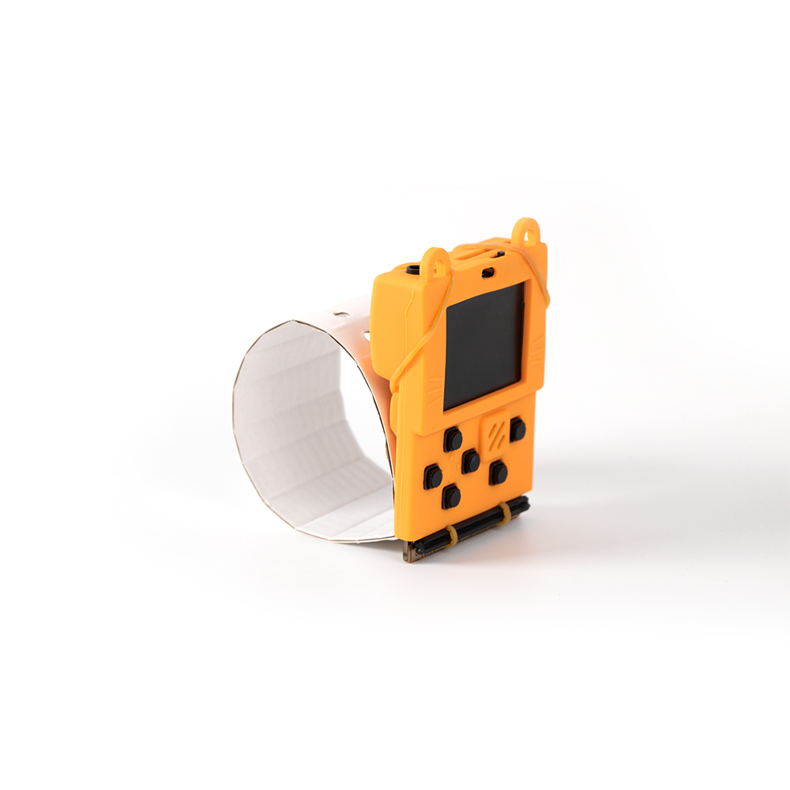

# 1. 計步裝置

## 教材資源包下載

包括說明書： [資源包下載地址](http://bit.ly/MeowbitCreatorKit_SH_ResourcsePack)

## 參考接線

本案例毋須接線。

## 參考程式

[計步裝置參Arcade考程式](https://makecode.com/_8y80L58cDYL2)

[Kittenblock sb3 參考程式資源包下載地址](http://bit.ly/MeowbitCreatorKit_SH_ResourcsePack)

## 模型玩法

將計步器戴在手上，你的步數會顯示在Meowbit上。