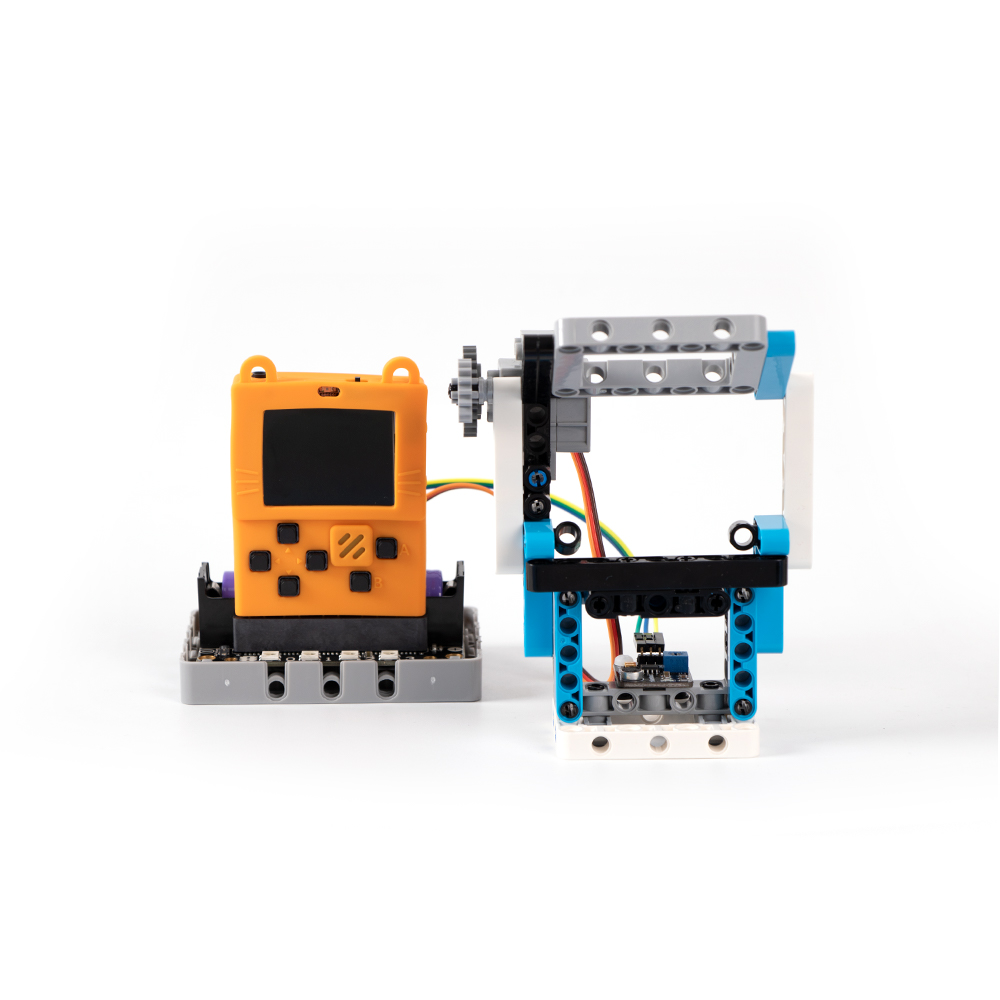
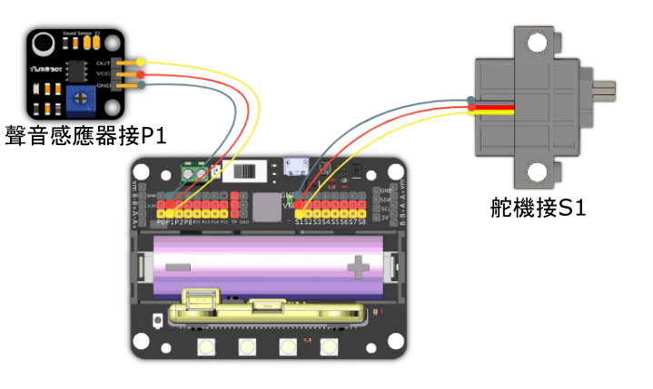

# 8. 防噪窗

## 教材資源包下載

包括說明書： [資源包下載地址](http://bit.ly/MeowbitCreatorKit_SH_ResourcsePack)

## 參考接線

## 參考程式

[防噪窗Arcade參考程式](https://makecode.com/_PLWY3se9MFqD)

[Kittenblock 參考程式資源包](http://bit.ly/MeowbitCreatorKit_SH_ResourcsePack)

## 模型玩法

遇到環境的噪音過大的時候，窗口會自動關上。待環境噪音回復至平靜水平時才會自動打開。

