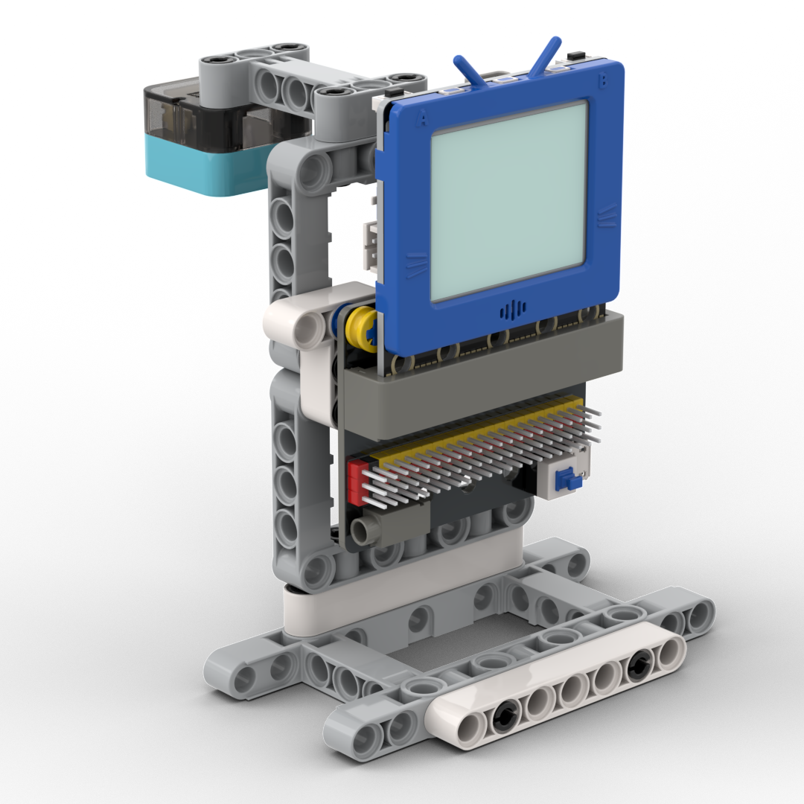
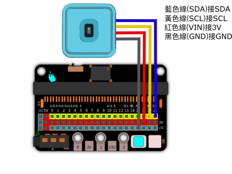

# 雨量檢測

一個可以檢測雨量的模型。

## 搭建說明書

[下載搭建說明書](https://github.com/kittenbothk/kittenbothk/raw/master/Kits/weatherstation/instructions/rainfall.pdf)

## 接線圖

## 範例程式

[下載範例程式](https://github.com/kittenbothk/kittenbothk/raw/master/Kits/weatherstation/sb3/2_rainfall.sb3)

[下載範例python程式](https://github.com/kittenbothk/kittenbothk/raw/master/Kits/weatherstation/py/2_rainfall.py)