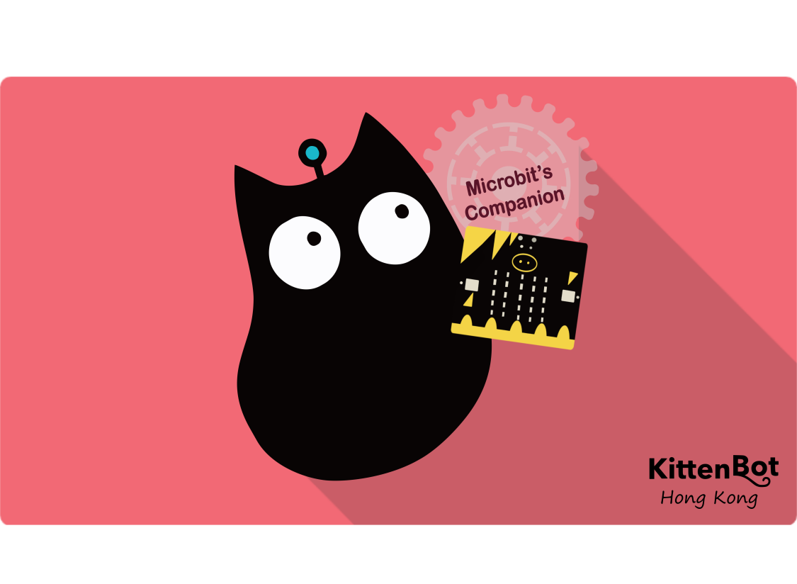

# KittenBot產品與MakeCode

## 進入MakeCode

支援KittenBot產品的其中一款編程平台是微軟Makecode。

MakeCode 地址:  [https://makecode.microbit.org/](https://makecode.microbit.org/)

## KittenBot產品在MakeCode上編程

**~小編提示~**

在住後的編章中, 只要見到下圖分欄隔, 表示該章節是利用Makecode 編程作示範啊~

.

1. **首先進入MakeCode，建立新專案**

 

2. **加載插件**

   編程之前我們需要先載入KittenBot產品的插件。

   在此教程我們會使用Powerbrick作為示範例子，把Powerbrick的插件加積木選項欄之中。

    KittenBot不同產品需要不同的插件，插件資料可以在各產品的教程中找到。

 

複製以下地址，在搜尋欄貼上並搜尋。

### https://github.com/KittenBot/pxt-powerbrick

 

點擊加載，加載成功後會新增PowerBrick的積木塊。

 

