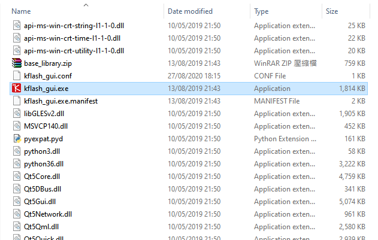

# **KOI固件更新教學**

開發團隊會不定時為KOI推出更新固件，以改進KOI AI鏡頭的功能。

用家可到這裏查看最新的固件版本, 以下為更新KOI 固件的方法。

(建議在更新固件前, 前先把現版本的固件也保存下來, 若在更新固件後遇到不良情況, 可回復到前一版本的固件)

## 重刷前準備

. 更新固件需要預備

1. **刷件程式**kflash , 
2. **固件檔案**;

點擊以下連結準備。

[下載刷件程式kflash](https://dl.sipeed.com/MAIX/tools/kflash_gui/kflash_gui_v1.6.5)

[固件檔案下載](./updateHist.md)

. 將KOI插入電腦的USB接口。

 

-

## 安裝刷件程式kflash

1. **按照電腦的作業系統下載刷件程式。**

2. **將檔案解壓縮。**

3. **打開kflash_gui.exe。**  

 

4. **請允許運行。**

## 刷入新固件

1. 在kflash 中打開先前已下截好的固件檔案。           

   

2. **在Board選擇Sipeed Maixduino。**

 

3. **在Port選擇連接KOI的接口。**

  

4. **其他設定可以使用預設值，按下載。** 

    

5. **耐心等待下載完成。**

 

6. **下載完成！**

 

7. **按Reset重啟KOI。**

 

